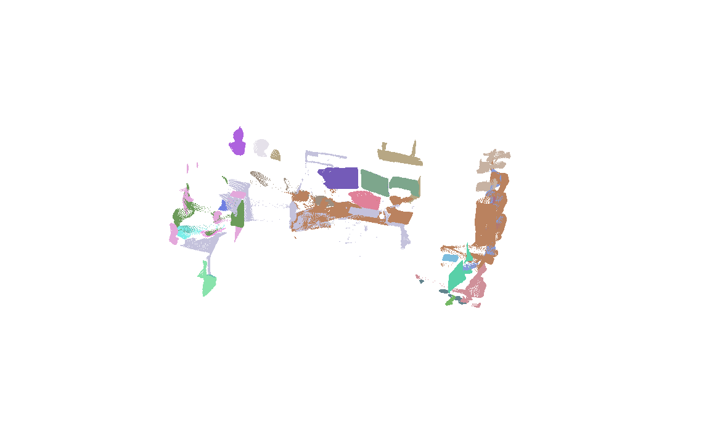
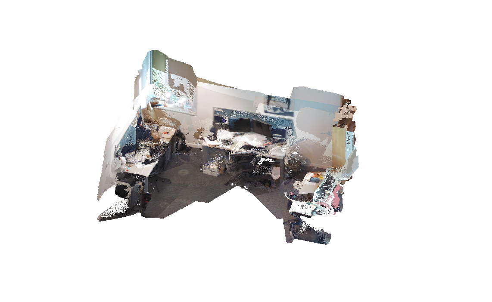

# humanoid-spatial-perception

[](https://creativecommons.org/licenses/by-nc-sa/4.0/)

This system creates a coherent reconstruction from a monocular video stream *without calibration or camera poses* and segments objects using semantic labels in 3D in *near-real time* on a *laptop-grade* GPU (RTX 3500 Ada Generation, 12GB VRAM). This repository makes heavy use of MASt3R, a feed-forward 3D reconstruction model. A SLAM method is used as the foundation, while semantic segmentation masks are generated in the pixel space. These semantic masks are matched over different views by exploiting MASt3R, and are reprojected into 3D points using the pixel-to-point correspondance of the model prediction outputs.

See [Design Notes](#design-notes) for discussion.

## Example
### Input / Output:
Given a folder containing image stream from a video, the following outputs are created:

```
sequence.ply:             pointcloud reconstruction of scene
sequence.txt:             estimated camera poses
sequence_instances.ply:   pointcloud reconstruction of segmented instances within scene
sequence_instances.json:  .json file of instance with labels and positions
```

### TUM RGB-D freiburg1_desk


### Example .json output
```
{
    "instance_id": 0,
    "label": "monitor",
    "score": 23914800.0,
    "support_count": 1132,
    "last_seen": 305,
    "centroid": [
      -0.49060535430908203,
      0.0665006935596466,
      0.9251208305358887
    ],
    "bbox_min": [
      -3.628385305404663,
      -2.4940264225006104,
      -0.43346789479255676
    ],
    "bbox_max": [
      2.551426887512207,
      3.1989927291870117,
      5.131761074066162
    ],
    "keyframes": [
      0,
      0,
      5,
      5,
      10,
      15,
      20,
      24,
      25,
      50,
      ...
    ],
    "num_points": 60362
  },
```

### 7-Scenes office



## Installation

### 1. Clone submodules

```bash
git submodule update --init --recursive
```

### 2. Create conda environment

```bash
conda create -n hsp python=3.12 cmake=3.14.0
conda activate hsp

pip install torch==2.10.0 torchvision --index-url https://download.pytorch.org/whl/cu128
```

### 3. Install MASt3R-SLAM

See [MASt3R-SLAM](https://github.com/JinRhee/MASt3R-SLAM) for full instructions. Summary:

```bash
cd external/MASt3R-SLAM
pip install --no-build-isolation -e thirdparty/mast3r "numpy==1.26.4"  # pin numpy to avoid recompilation
pip install --no-build-isolation -e thirdparty/in3d  # may need: pip install "cython<3.0"
pip install --no-build-isolation -e .
cd ../..
```

Download MASt3R checkpoints:

```bash
mkdir -p external/MASt3R-SLAM/checkpoints
wget https://download.europe.naverlabs.com/ComputerVision/MASt3R/MASt3R_ViTLarge_BaseDecoder_512_catmlpdpt_metric.pth \
  -O external/MASt3R-SLAM/checkpoints/mast3r_v1.pth
wget https://download.europe.naverlabs.com/ComputerVision/MASt3R/MASt3R_ViTLarge_BaseDecoder_512_catmlpdpt_metric_retrieval_trainingfree.pth \
  -O external/MASt3R-SLAM/checkpoints/mast3r_v2.pth
wget https://download.europe.naverlabs.com/ComputerVision/MASt3R/MASt3R_ViTLarge_BaseDecoder_512_catmlpdpt_metric_retrieval_codebook.pkl \
  -O external/MASt3R-SLAM/checkpoints/mast3r_codebook.pkl
```

### 4. Install SegMASt3R

See [SegMASt3R](https://github.com/SegMASt3R/segmast3r) for original implementation. We use only their prediction heads.
Download the pre-extracted heads checkpoint (downstream heads + feature matcher only, ~600 MB vs 3.5 GB for the full checkpoint):

```bash
wget https://huggingface.co/JinRhee/segmast3r_heads_only/resolve/main/heads_only.pt \
  -O external/segmast3r/checkpoints/heads_only.pt
```

Alternatively, extract the heads from the full checkpoint yourself:

```bash
wget https://huggingface.co/rjayanti/segmast3r/resolve/main/segmast3r_spp.ckpt \
  -O external/segmast3r/checkpoints/segmast3r_spp.ckpt
python tools/distill.py
```

### 5. Install Grounded-SAM-2

See [Grounded-SAM-2](https://github.com/IDEA-Research/Grounded-SAM-2) for full instructions. Summary:


```bash
export CUDA_HOME=/path/to/cuda-12.8/

cd external/Grounded-SAM-2
pip install -e .
pip install -r grounding_dino/requirements.txt  # install_requires is commented out in setup.py
pip install transformers==4.37.0 # Latest transformer release incompatible
pip install --no-build-isolation -e grounding_dino
cd ../..
```

Download checkpoints:
```bash
cd external/Grounded-SAM-2/checkpoints && bash download_ckpts.sh && cd ../../..
cd external/Grounded-SAM-2/gdino_checkpoints && bash download_ckpts.sh && cd ../../..
```

## Datasets

Download benchmark datasets using the MASt3R-SLAM scripts (run from the repo root):

```bash
# TUM RGB-D
bash external/MASt3R-SLAM/scripts/download_tum.sh

# 7-Scenes
bash external/MASt3R-SLAM/scripts/download_7_scenes.sh

# ETH3D
bash external/MASt3R-SLAM/scripts/download_eth3d.sh

# EuRoC MAV
bash external/MASt3R-SLAM/scripts/download_euroc.sh
```

Each script creates and populates a `datasets/<name>/` directory at the repo root.

## Run

```bash
./run_pipeline \
  --images_dir /absolute/path/to/images \
  --config configs/pipeline.yaml \
  --output_dir path/to/output

# Example using 7-scenes office dataset
./run_pipeline --dataset datasets/7-scenes/office/ --output_dir results --config configs/default.yaml

# Example using 7-scenes fire dataset
./run_pipeline --dataset datasets/7-scenes/fire/ --output_dir results --config configs/default.yaml

# Example using TUM RGB-D 
./run_pipeline --dataset datasets/tum/rgbd_dataset_freiburg1_desk --output_dir results --config configs/default.yaml
```


## Using known intrinsics

Create a YAML file with the camera parameters at the original image resolution:

```yaml
width: 1920
height: 1080
calibration: [fx, fy, cx, cy]                    # no distortion
# calibration: [fx, fy, cx, cy, k1, k2, p1, p2]  # with distortion (OpenCV convention)
```

Pass it with `--calib`:

```bash
./run_pipeline \
  --dataset /path/to/images \
  --config configs/default.yaml \
  --output_dir /path/to/output \
  --calib /path/to/calib.yaml
```

Without `--calib` the pipeline runs in uncalibrated mode using ray-based optimisation.

## Convert video to pipeline-ready images

```bash
./video_to_images \
  --input_video /absolute/path/to/video.mp4 \
  --output_dir /absolute/path/to/images \
  --start_sec 0 \
  --start_nsec 0
```

This writes JPEG frames named `images_<sec>_<nsec>.jpg`, matching the ingestion format used by the pipeline.
It requires `ffmpeg` and `ffprobe` to be available on `PATH`.

# Design notes
MASt3R-SLAM is used as the main state estimator, providing a coherent and accurate geometry.
SegMASt3R originally matches segments across two views. The segment masks usually come from segmentation models such as SAM2.
Grounded-SAM-2 provides semantic labels and segmentations from a list of keywords in `configs/keywords.txt`.

The task conditions are taken literally; intrinsics or camera poses are assumed to be unknown, though the intrinsics can be used if known.

SegMASt3R was chosen for matching as the work only adds downstream heads to the existing MASt3R model architecture used for MASt3R-SLAM.
Matching (tracking) of segments can be achieved using a minimal change to the existing MASt3R model. It is also capable of two-view matching from images that have a large disparity. Thanks to this, semantic segmentation and matching only needs to occur at selected keyframes, and does not need to continuously track (which would hinder runtime performance).

MASt3R is already surpassed by other feed-forward reconstruction models. Given camera poses from a state estimator, models such as DepthAnything v3 could be used for more accurate reconstructions.

Feed-forward models return pointmaps, which are pointclouds where every point has a corresponding pixel correspondance. Semantic masks predicted on the image therefore maps exactly to the 3D geometry; however this means that artefacts from image segmentation (i.e. patchy mask, undersegmentation, oversegmentation etc.) cannot be easily accounted for in the current state.

Semantic 3D reconstruction orchestration wrapper around:
- `external/MASt3R-SLAM`
- `external/segmast3r`
- `external/Grounded-SAM-2`


### Why a SLAM pipeline?
Feed-forward reconstruction models (MASt3R, VGGT, MapAnything, DepthAnything v3) show visually appealing results. However, their predictions are only precise (i.e. comparable with a physical sensor such as LiDAR) when given accurate poses (MapAnything, DepthAnything v3) or feature dense views.

SLAM pipelines such as MASt3R-SLAM, VGGT-SLAM, etc. provide backend optimization (often through pose graphs) to ensure geometric coherence of the reconstruction.

Further, feed-forward 3d reconstruction models (VGGT, MapAnything) perform best when an entire image sequence (50~60 images) are fed through at once. This places a minimum requirement on GPU VRAM (i.e. server / desktop GPUs), making mobile deployment difficult. SLAM pipelines such as MASt3R-SLAM or VGGT-SLAM only use a handful of images per inference, making it viable on mobile platforms such as a humanoid.

### Why not VGGT, MapAnything, or any SOTA model?
We could definitely use other SOTA models. For the convenient use of SegMASt3R (which relies on pixel-match predictions from MASt3R), MASt3R is used. The foundation model could be easily swapped to other models, provided that a different matching method is used (i.e. SAM2 tracking).

Pose estimates from a separate localization pipeline could also be fed into newer models such as MapAnything or DepthAnything v3 for more accurate reconstructions.

<!-- 
## Adapter configuration

The pipeline expects adapter factories for MASt3R backbone + SLAM, Grounded-SAM-2, and SegMASt3R. These are configured in
`configs/pipeline.yaml` under `backbone.factory`, `slam.factory`, `grounded_sam2.factory`, and `segmast3r.factory`.
The default config leaves the SLAM/Grounded-SAM-2/SegMASt3R factories unset, so fill them in when using those modes.

`backbone.factory` is set to `hsp_pipeline.backbone:create_mast3r_backbone`.
`backbone.model_factory` should point to the MASt3R model loader (`module:function`). The built-in
`create_mast3r_backbone` adapter uses unified inference:
- encode once per frame (cached on frame object),
- symmetric decode (i→j and j→i),
- branch outputs into SLAM tensors `(X, C, D, Q)` and SegMASt3R descriptors `(desc_i, desc_j)`.

Set `slam.factory`, `grounded_sam2.factory`, and `segmast3r.factory` to `module:function` callables that return adapters with:
- MASt3R backbone: `run_pair(image_a, image_b)` and `run_single(image)` returning pointmaps + feature grids.
- MASt3R-SLAM: `run(frames, backbone)` returning a trajectory and optional global map.
- Grounded-SAM-2: `predict(image, prompts, max_masks)` returning masks + scores.
- SegMASt3R: `encode_mask(features, mask)` returning a descriptor.

For smoke testing without external dependencies, set `backbone.mode: stub`, `slam.mode: stub`, `grounded_sam2.mode: stub`,
and `segmast3r.mode: stub` in the config.
-->
